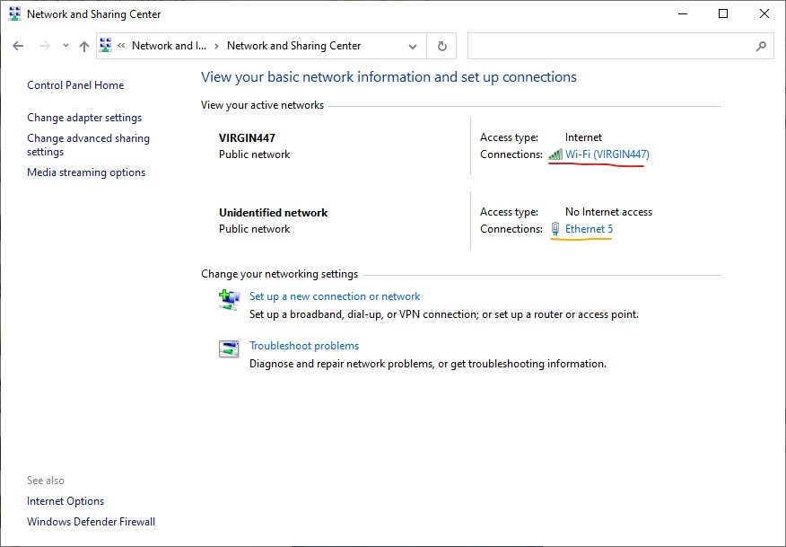
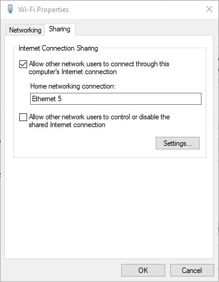

# Getting Started

## General Cheat Sheet

Raspberry pi ip: pi@raspberrypi.local
Raspberry pi password: queenseng

## Set-Up for Windows 10

### Installing ssh

Please keep in mid that those instructions are if you have a recent version of windows 10, if you don't have anything that is more recent than a 2019 version, please update your Windows 10.

Windows does not come pre-installed with ssh, which is what we will be using to access the pi. Fortunately now with Windows 10, you can install ssh quite easily.

Open a new PowerShell windows as an administrator (right-click the powershell icon and select "Run as an administrator")

Copy and paste the command
```powershell
Add-WindowsCapability -Online -Name OpenSSH.Client*
```

Congrats you now have ssh!

### Sharing your internet connection the Pi

1. Plug in your raspberry pi, ensure that the green LED is on and wait for like a minute.
2. Open the *Control Panel*.
3. Go to *Network and Internet*.
4. Go to *Network Sharing Center*. The network underlined in red is your **internet network**, the network underlined in orange will be your **raspberry pi network**.
   
5. Click on your **internet network**, then click on *Properties* (requires admin permissions), then go to the *Sharing* tabs.
6. Enable "Allow other network users to connect through this computer's Internet connection" adn in the dropdown menu select the network that corresponds to your **raspberry pi network**. 
   

You should be good to go now, give the pi a minute to connect.

## Connecting to the Pi (macOS and Windows 10)

0. Make sure to connect your pi is connected and the green LED is on.
1. Open a PowerShell window and type in:
    ```powershell
    ssh pi@raspberrypi.local
    ```
2. The password you will have to enter will be queenseng
3. Test the internet connection by typing `ping google.com`, if you get no error you are good to go!
